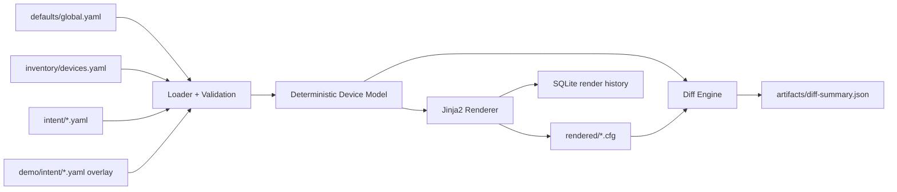

# intent-config-workbench

[](https://github.com/RedBeret/intent-config-workbench/actions/workflows/ci.yml)
[](LICENSE)
[](https://www.python.org/downloads/)

Opinionated Windows-first lab repo for turning YAML intent into deterministic network-like config artifacts and reviewable diffs.

This is the step before transport and execution. It is the clean precursor to Ansible.

Maintained in the open by `RedBeret`.

The repo is written in a practical RedBeret-style lab format:

- local only
- synthetic only
- explicit validation
- deterministic output
- simple Windows entrypoints

## Why this repo exists

A lot of automation examples jump straight to pushing config. This repo slows that down on purpose.

It focuses on the part that usually gets hand-waved:

- modeling desired state
- validating intent before rendering
- producing stable artifacts
- reviewing diffs before execution

If the model is messy, transport automation just makes the mess faster.

## Everything here is fake by design

- Synthetic hostnames such as `edge-01` and `dist-01`
- RFC5737 example IPs such as `192.0.2.21/24`
- Fake serials such as `SYN-EDGE-0001`
- Fake usernames such as `ops_lab`
- Fake secret tokens such as `SYNTHETIC-OPS-LAB`
- No real credentials
- No customer data
- No proprietary images
- No external device access

## What this teaches

- Intent modeling with clear separation between `inventory/`, `intent/`, and `defaults/`
- Field-level schema validation with Pydantic
- Deterministic generation with stable ordering and reproducible outputs
- Jinja2-based rendering into CLI-like configs
- Config diff review before change acceptance
- Local operational discipline with health checks, retries, timeouts, idempotent writes, and rollback notes

## What this is not

- It is not an automation runner for real devices
- It is not an Ansible replacement
- It is not a secrets store or credential management system
- It is not production-ready network operating system modeling
- It is not tied to any vendor CLI or proprietary image

## Highlights

- Windows PowerShell is the main entrypoint
- Linux-only tooling is isolated to WSL2 Ubuntu or Docker
- Same input produces the same output
- Invalid intent fails with clear field-level errors
- Demo path finishes in under five minutes on a normal workstation
- Golden file tests lock the rendered output shape
- SQLite keeps a lightweight local render history
- GitHub Actions validates the Windows wrapper workflow on `windows-latest`

## One-command demo

PowerShell 7 is the primary interface on Windows.

```powershell
pwsh -File .\scripts\Render-All.ps1 -Bootstrap -Demo
```

That command:

1. creates a local `.venv` if needed
2. installs the project in editable mode with dev dependencies
3. validates the synthetic intent
4. renders `rendered\*.cfg`
5. applies the demo overlay from `demo\intent\`
6. writes `artifacts\diff-summary.json` and `artifacts\demo.patch`

Useful commands:

```powershell
pwsh -File .\scripts\Render-All.ps1 -Bootstrap
pwsh -File .\scripts\Test-Intent.ps1 -Bootstrap
python -m intent_config_workbench.cli health --workspace .
```

## GitHub-ready defaults

This repo ships with the usual public-project essentials:

- Windows CI in GitHub Actions
- issue templates for bugs, features, and docs
- a pull request template
- CODEOWNERS for `@RedBeret`
- Dependabot config for Python dependencies and GitHub Actions
- a security policy for private reporting

## Quick example

Input intent:

```yaml
hostname: edge-01
interfaces:
  - name: Ethernet2
    description: user-segment-a
    enabled: true
    mode: access
    access_vlan: 20
vlans:
  - id: 20
    name: USERS_A
```

Rendered output:

```text
interface Ethernet2
 description user-segment-a
 switchport mode access
 switchport access vlan 20
 mtu 1500
 no shutdown
```

Candidate diff from the demo overlay:

```diff
+interface Ethernet4
+ description lab-camera-segment
+ switchport mode access
+ switchport access vlan 40
```

## Architecture



## Repo layout

```text
intent-config-workbench/
|-- defaults/
|-- inventory/
|-- intent/
|-- demo/intent/
|-- templates/
|-- src/intent_config_workbench/
|-- scripts/
|-- docs/
|-- tests/
|-- rendered/
`-- artifacts/
```

Directory purpose:

- `defaults/` holds shared synthetic defaults plus retry and timeout settings
- `inventory/` holds per-device metadata and management settings
- `intent/` holds desired state for users, interfaces, VLANs, and routing placeholders
- `demo/intent/` holds partial overlays for the demo path
- `templates/` holds Jinja2 templates for deterministic rendering
- `rendered/` holds generated config artifacts
- `artifacts/` holds demo candidate output, diff patch, and JSON summary
- `scripts/` holds PowerShell wrappers for Windows users
- `docs/` holds engineering notes, runbook, study guide, failure modes, ADRs, and review questions
- `tests/` holds golden files, validation tests, rerender tests, and diff tests

## Windows, WSL2, and Docker

Windows is the main experience. If you need Linux-only tooling, use WSL2 Ubuntu or Docker.

WSL2:

```bash
make install
make demo
```

Docker:

```powershell
docker compose build tooling
docker compose run --rm tooling make demo
```

Direct CLI usage after install:

```powershell
python -m intent_config_workbench.cli validate --workspace .
python -m intent_config_workbench.cli render --workspace .
python -m intent_config_workbench.cli diff --workspace .
python -m intent_config_workbench.cli health --workspace .
python -m intent_config_workbench.cli demo --workspace .
```

## Determinism guarantees

- Device processing order is sorted by hostname
- Users, interfaces, VLANs, and static routes are sorted before rendering
- Output uses LF line endings
- Files are only rewritten when content changes
- Diff JSON is emitted with sorted keys

## Health, retries, and safety

- Validation fails early with clear field-level errors
- Rendering uses explicit timeouts
- File writes and SQLite writes retry with exponential backoff
- Render writes are idempotent
- Health checks call out missing inputs and missing database files

## Rollback notes for mutating workflows

- `scripts/Render-All.ps1 -Bootstrap`
  Rollback: remove `.venv\` if you want to discard the local environment.
- `render`
  Rollback: delete `rendered\*.cfg` and `.workbench\workbench.db`, then rerun `render` from known-good intent.
- `diff` or `demo`
  Rollback: delete `artifacts\candidate\`, `artifacts\diff-summary.json`, and `artifacts\demo.patch`.
- Editing files under `intent/`, `inventory/`, or `defaults/`
  Rollback: restore the edited YAML from the last known-good copy, then rerun `validate`.
- `scripts/Test-Intent.ps1`
  Rollback: remove `.pytest_cache\` if you want to clear local test residue.

## Docs

- [Engineering notes](docs/engineering-notes.md)
- [Study guide](docs/study-guide.md)
- [Runbook](docs/runbook.md)
- [Failure modes](docs/failure-modes.md)
- [Review questions](docs/review-questions.md)
- [ADR 0001](docs/adr/0001-windows-first-local-only.md)
- [ADR 0002](docs/adr/0002-deterministic-rendering.md)
- [ADR 0003](docs/adr/0003-diff-and-snapshot-strategy.md)

## Contributing

If you want to extend the repo, start with [CONTRIBUTING.md](CONTRIBUTING.md).

Short version:

- keep everything synthetic
- keep Windows as the primary path
- keep output deterministic
- do not introduce real credentials, real hostnames, or real device data

## License

MIT. See [LICENSE](LICENSE).
# intent-config-workbench
