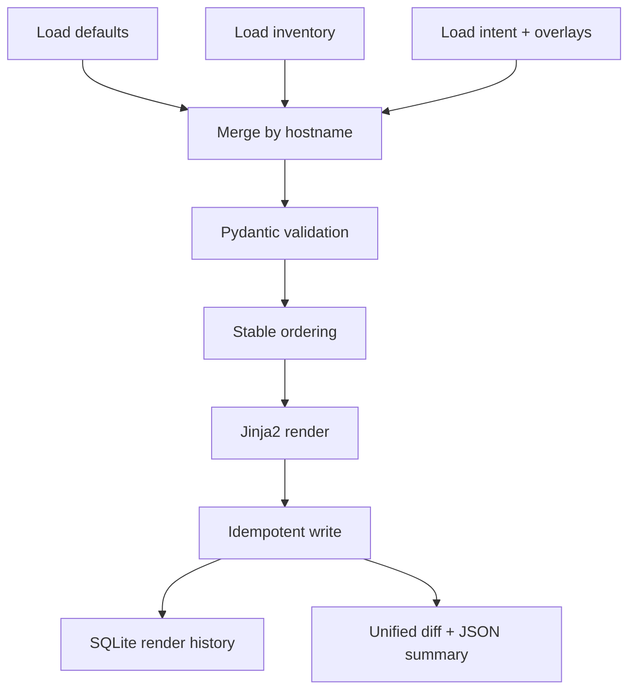

# Engineering Notes

## Goal

This repo turns high-level intent into stable, deterministic, CLI-like configuration artifacts for synthetic network devices. It is intentionally the clean precursor to transport and execution tooling such as Ansible.

## Deterministic generation choices

- Inputs are split into `defaults/`, `inventory/`, and `intent/`
- Inventory data and intent data are merged into a single validated device model
- Lists are sorted before rendering so input file ordering does not change output ordering
- Rendered files use LF line endings and content-address checksums
- Writes are idempotent: unchanged files are not rewritten
- Diff JSON uses stable ordering and consistent key serialization

## Why the split matters

- `defaults/` captures shared, low-volatility settings
- `inventory/` captures device identity and management-plane facts
- `intent/` captures desired state
- `rendered/` is disposable output, not the source of truth

## Validation model

Pydantic validates:

- Hostnames
- Management addressing
- Fake serial formats
- Synthetic usernames
- Interfaces and mode-specific constraints
- VLANs
- Routing placeholders

The most important design choice is that invalid data fails before rendering. That makes the repo deterministic and easier to reason about in code review.

## Resilience controls

- Structured JSON logging for machine-readable runs
- Explicit timeouts around render operations
- Retries with exponential backoff around filesystem and SQLite writes
- Local-only health checks for required files and directories

## Why SQLite is here

The rendered configuration files are the primary artifacts. SQLite gives the repo a simple local history of render runs without adding network dependencies or external services.

## Render pipeline

## Notes on overlays

The demo uses `demo/intent/edge-02.yaml` as a partial overlay. The loader deep-merges that overlay onto the base device intent, which lets the repo model a candidate change without overwriting the baseline intent.

## Rollback notes

- Editing the template in `templates/device_config.j2`
  Rollback: restore the template from the previous known-good version, then rerun `render` and compare diffs.
- Changing defaults in `defaults/global.yaml`
  Rollback: restore the file and rerun `validate` plus `render`.
- Changing merge or sorting logic in `src/intent_config_workbench/`
  Rollback: restore the previous code, rerun `pytest`, then rerender to confirm stable output.
